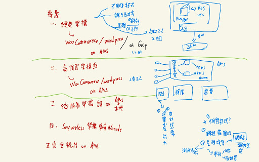
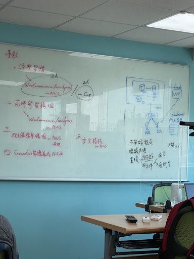

# 第一組-雲端經典架構(WordPress)

不用碰程式
全都在課程內容內
1. 呈現一個網站
2. 需要有學習文件(對象：組員、面試官)

AWS 2 人
GCP 2人

wordpress的應用程式

IAM 1.系統 2.用戶

在aws或gcp上應用經典架構
在aws或gcp上架wordpress網站

(6)柴道融
(3)謝宜庭
(10)張再富
(2)董于嘉

-----
## AWS console URL
> <https://726526211588.signin.aws.amazon.com/console> 
> <https://cfc104-project01.signin.aws.amazon.com/console> 

## AWS && GCP 服務對應

功能|AWS 服務|GCP 服務
-|-|-
DNS 服務|Route 53|Cloud DNS
伺服器|EC2 (Elastic Compute Cloud)|Compute Engine
資料庫|RDS (Relational Database Service)|Cloud SQL
儲存|S3 (Simple Storage Service)|Cloud Storage
權限管理|IAM (Identity and Access Management)|IAM
人員稽核|CloudTrail|
系統監控|CloudWatch|Cloud Monitoring
程式碼儲存庫|CodeCommit|Cloud Source Repositories 
程式碼編譯、建構|CodeBuild|Cloud Build
佈署|Code Deploy|Cloud Deploy
容器儲存庫|ECR (Elastic Container Registry)|Container Registry

## 資源命名規則(含Tag)

> {專案名稱}-{資源名稱}-{使用人員}-{應用或用途}-{備註(非必要)} 
> ※例如: cfc104_project1-EC2-10-wordpress-test 
> 專案名稱: cfc104_project1 
> 資源名稱: EC2 
> 使用人員: 10 
> 應用或用途: wordpress 
> 備註: test 

## AWS settings
> [AWS-settings](./assets/AWS-settings)

## wordpress document
> [wordpress](./assets/wordpress)

## note

SystemAdministrator

wordpress 多媒體存 S3

CDN

ELB 負載均衡

