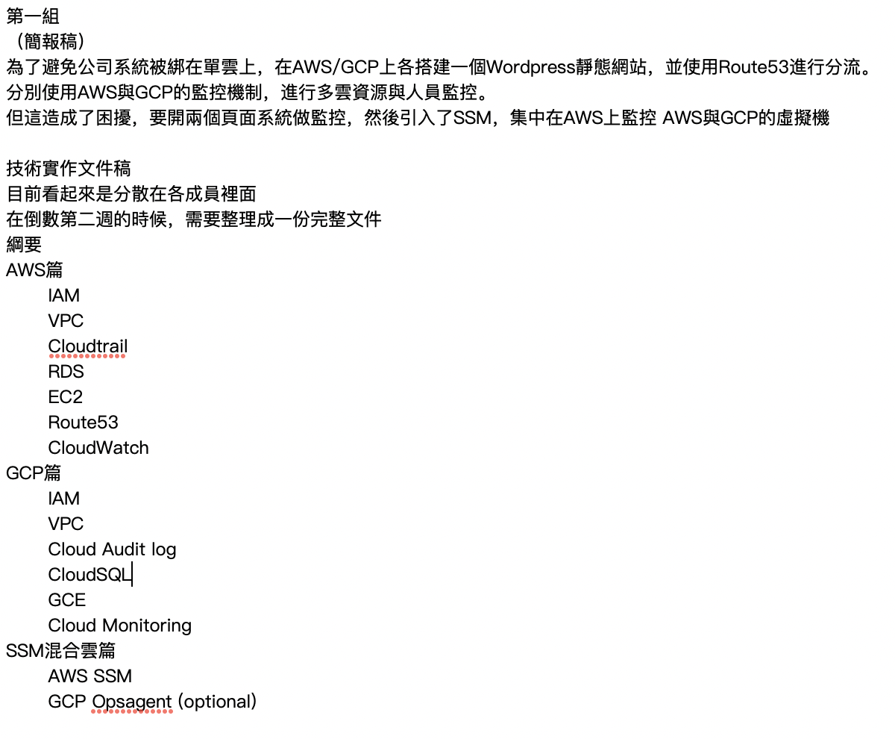
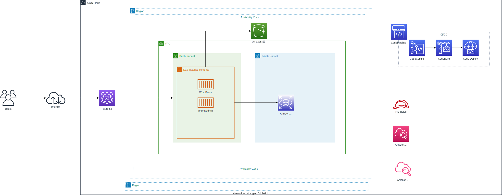

# 第一組-雲端經典架構(WordPress)

## Summary
return [Summary](#summary)

- [第一組-雲端經典架構(WordPress)](#第一組-雲端經典架構wordpress)
  - [Summary](#summary)
  - [Members](#members)
  - [AWS console URL](#aws-console-url)
  - [Resource naming rules (including tags)](#resource-naming-rules-including-tags)
  - [CI/CD](#cicd)
  - [AWS and GCP service mapping](#aws-and-gcp-service-mapping)
  - [AWS and GCP 比較](#aws-and-gcp-比較)
  - [總結](#總結)
  - [Architecture Diagram](#architecture-diagram)
    - [AWS](#aws)
  - [Todo list](#todo-list)
  - [AWS settings](#aws-settings)
  - [Wordpress document](#wordpress-document)
  - [Note](#note)
  - [Work log](#work-log)
  - [Meeting minutes](#meeting-minutes)
  - [Online](#online)
  - [Referance](#referance)

-----

不用碰程式
全都在課程內容內
1. 呈現一個網站
2. 需要有學習文件(對象：組員、面試官)

AWS 2 人
GCP 2人

wordpress的應用程式

IAM 1.系統 2.用戶

在aws或gcp上應用經典架構
在aws或gcp上架wordpress網站

-----

## Members
return [Summary](#summary)

> (6)柴道\*
> (3)謝宜\*
> (10)張\*富
> (2)董于\*

[new_user_credentials.csv(已變更)](./assets/new_user_credentials.csv)

-----

## AWS console URL
return [Summary](#summary)

> <https://726526211588.signin.aws.amazon.com/console> 
> <https://cfc104-project01.signin.aws.amazon.com/console> 

-----

## Resource naming rules (including tags)
return [Summary](#summary)

> {專案名稱}-{資源名稱}-{使用者ID(人員/群組/其他服務)}-{應用或用途}-{備註(非必要)} 
> ※例如: cfc104_project1-EC2-10-wordpress-test 
> 專案名稱: cfc104_project1 
> 資源名稱: EC2 
> 使用者ID: 10 
> 應用或用途: wordpress 
> 備註: test 

-----

## CI/CD

https://dev.classmethod.jp/articles/aws-hands-on-for-beginners-cicd/

-----

## AWS and GCP service mapping
return [Summary](#summary)

功能|AWS 服務|GCP 服務
-|-|-
DNS 服務|Route 53|Cloud DNS
伺服器|EC2 (Elastic Compute Cloud)|Compute Engine
資料庫|RDS (Relational Database Service)|Cloud SQL
儲存|S3 (Simple Storage Service)|Cloud Storage
權限管理|IAM (Identity and Access Management)|IAM
人員稽核|CloudTrail|Cloud Audit Logs
系統監控|CloudWatch|Cloud Monitoring
流程管理|CodePipeline|Cloud Source Repositories
程式碼儲存庫|CodeCommit|Cloud Source Repositories 
程式碼編譯、建構|CodeBuild|Cloud Build
佈署|Code Deploy|Cloud Deploy
容器儲存庫|ECR (Elastic Container Registry)|Container Registry

> https://comparecloud.in/?fbclid=IwAR3ACOiRt23TB8E7ncLsmDSDSHbTF4YxMIymT2rJWwusZfgMVYX1TPVwl0M

-----
## AWS and GCP 比較
return [Summary](#summary)

基礎設施
比較|AWS 服務|GCP 服務
-|-|-
基礎設施|AWS 目前在 16 個地理區域（ regions ）上有 42 個可用區域（ zones ），在已公告的計畫中顯示會在逐步新增 8 個可用區域和 3 個地理區域。|GCP 目前在 8 個地理區域(其中一個就在臺灣)上擁有 23 個可用區域。且擁有超過 100 個網路連接點（PoPs ）和數十萬英里的自有光纖網路（ fiber optic cable ），預計在今年結束前再新增 10 個可用區域，急起直追。

流量費用

比較|AWS 服務|GCP 服務
-|-|-
試用方案|新帳號第一年內部分服務每月有免費額度註1-4 可以使用|啟用試用方案註1-1 後第一年內有 300 美金額度可以試用所有服務組合（部分功能受限）
計費方式|以時計費|以分計費
優惠|預繳 1 或 3 年，可享有最低 5 折的優惠|連續使用滿一個月可獲7折優惠。綁定 1 年或 3 年有機會獲得 43 折優惠。部分服務項目有永久免費額度註1-2
估算工具|Simple Monthly Calculator註1-5|Pricing Calculator註1-3

註1-1 試用方案 https://cloud.google.com/free/?hl=zh-tw
註1-2 永久免費額度 https://cloud.google.com/free/docs/always-free-usage-limits
註1-3 Pricing Calculator https://cloud.google.com/products/calculator/
註1-4 免費額度 https://aws.amazon.com/tw/free/
註1-5 Sample Monthly Calculator http://calculator.s3.amazonaws.com/index.html 

架構與運算能力
通則當然是運算能力愈強愈好，但考量到運算能力往往和價位成正比，所以選擇三個頂尖供應商之中最符合成本效益又使用者經驗良好的很重要。以下以規格相近的運算主機來做比較：

比較|AWS 服務|GCP 服務
-|-|-
地區|美國|美國
機器類型|m3.medium|n1-standard-1
虛擬 CPU 數|1|1
記憶體|3.75 GB|3.75 GB
作業系統|Linux|Linux
硬碟空間|50 GB|50 GB
硬碟費用|USD$5|USD$2
主機費用|USD$49.05|USD$34.67
每月費用(主機+硬碟)|USD$54.05|USD$26.27(持續使用折扣註2-1 )
優惠後費用(主機+硬碟)|USD$40.04(預留執行個體一年無需預付)|USD$23.84(承諾使用折扣註2-2 一年)

註 2-1 持續使用折扣 https://cloud.google.com/compute/docs/sustained-use-discounts
註 2-2 承諾使用折扣 https://cloud.google.com/compute/docs/instances/signing-up-committed-use-discounts

referance:<https://www.mile.cloud/zh/resources/blog/cloud-platform-traffic-cost-comparison-google-GCP-Amazon-Microsoft_185>

-----

## 總結

在雲端運算的領域，其實很難判定哪個供應商是真正的贏家，而這份簡報也沒有要將雲端供應商分高下，因為 AWS 和 GCP 有各自的優點和吸引人的地方 —— AWS 是最經驗最豐富的，GCP 有對使用者較佳的定價策略，而且它還有機器學習方面的技術優勢。

所以回到簡報前面的問題，我們應該選擇哪一個雲端供應商為自己提供服務？答案是沒有標準答案，要依照個人或組織的使用需求和用量，決定最適合的雲端服務供應商。

https://aprilyang.home.blog/2021/06/24/aws-azure-gcp/

-----

## Architecture Diagram
return [Summary](#summary)

### AWS
> 

-----

## Todo list
return [Summary](#summary)

目標
建立 wordpress 網站並在雲端維運

流程概要

  1) 本地端建置wordpress網站
  2) wordpress網站匯出
  3) AWS/GCP 環境建構
  4) wordpress網站匯入AWS/GCP環境
  5) 測試

使用者角色

- Wordpress website editor
- AWS/GCP manager
- Project manager

建置步驟

參數
Name | Value
-|-

Account Alias|cfc104-project01

Name | Value
-|-
Group name|cfc104_project
User name|cfc104_02, cfc104_03, cfc104_06, cfc104_10

Name | Value
-|-
VPC|cfc104-project1-wordpress-VPC
public subnet|cfc104-project1-wordpress-subnet-public|
private subnet|cfc104-project1-wordpress-subnet-private|

Name | Value
-|-
EC2|cfc104-project1-wordpress-ec2-public
Amazon Machine Image (AMI)|Amazon Linux 2 AMI (HVM) - Kernel 5.10, SSD Volume Type
Instance Type|t2.micro
Network|cfc104-project1-wordpress-VPC
subnet|cfc104-project1-wordpress-subnet-public
Volume Type|General Purpose SSD (gp2)
Security Group|cfc104-project1-wordpress-sg-public

Domain name|cfc104.project1.com
RDS CNAME|rds.cfc104.project1.com

S3|cfc104-project1-wordpress-s3

- wordpress set up
  - [X] Docker
    - docker-compose
  - [X] web site
  - [X] plugins
    - woocommerce
    - all-in-one-wp-migration

- AWS set up
  - [X] IAM
  - [X] VPC
  - [X] EC2
  - [X] RDS
  - [X] S3
  - [X] Route53(private route)
  - [X] CloudTrail
  - [X] CloudWatch
  - [ ] SSM

- GCP set up
  - [X] IAM
  - [X] VPC
  - [X] GCE
  - [X] CloudSQL
  - [X] Cloud Storage
  - [X] Cloud DNS(private route)
  - [ ] Cloud Audit log
  - [X] Cloud Monitoring
  - [ ] ~~Opsagent(optional)~~

-----

## AWS settings
return [Summary](#summary)

> [AWS-settings](assets/AWS-settings.md)

-----

## Wordpress document
return [Summary](#summary)

> [wordpress](./assets/wordpress.md)

-----

## Note
return [Summary](#summary)

[test to wordpress.md#note](assets/wordpress.md#note)

SystemAdministrator

wordpress 多媒體存 S3

CDN

ELB 負載均衡

https://medium.com/tensult/configure-ftp-on-aws-ec2-85b5b56b9c94

-----

## Work log
return [Summary](#summary)

> [Work log](./assets/WorkLog.md)

-----

## Meeting minutes
return [Summary](#summary)

> [Meeting minutes](./assets/MeetingMinutes.md)

-----

## Online
return [Summary](#summary)

[this page](https://github.com/rockexe0000/cfc104_project1)

-----

## Referance
return [Summary](#summary)

[AWS雲端經典架構建置WordPress網站 (參考資料1)](assets/AWS雲端經典架構建置WordPress網站(參考資料1).md)

