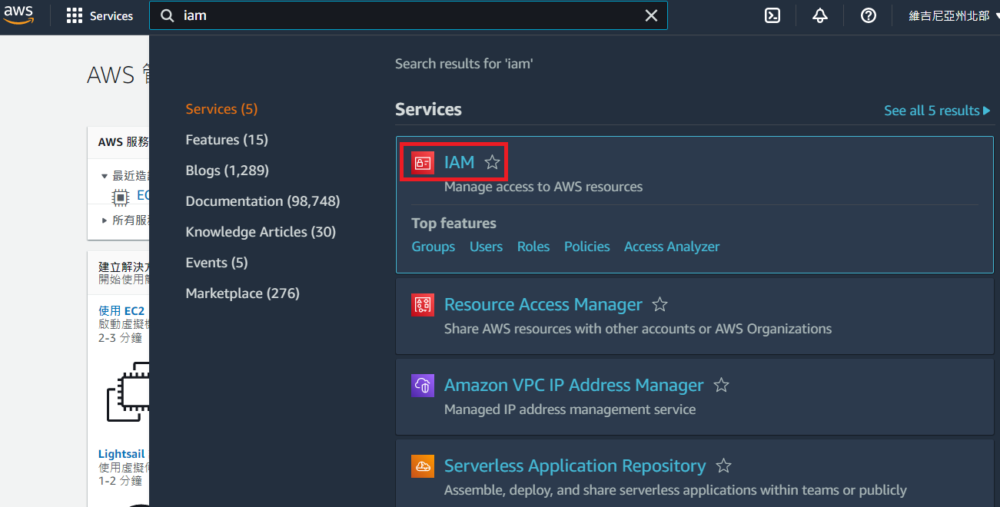
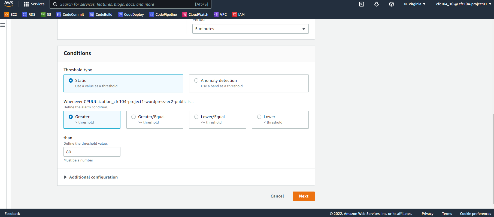
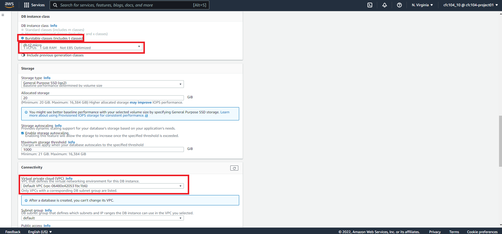
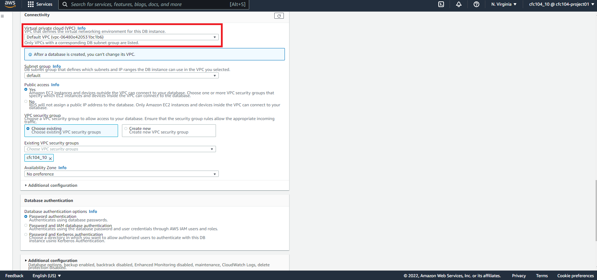
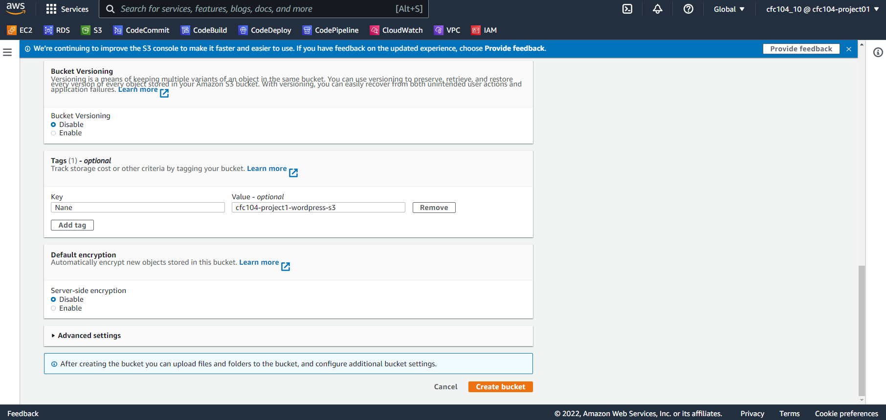
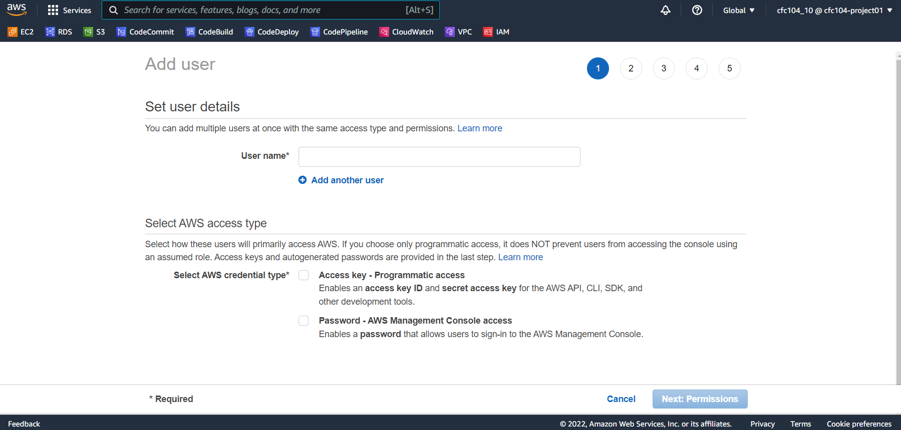
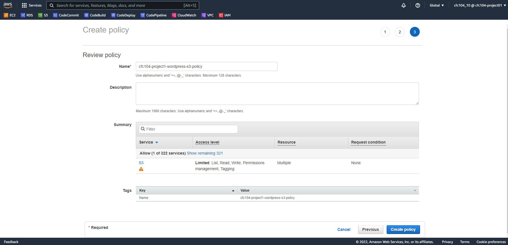
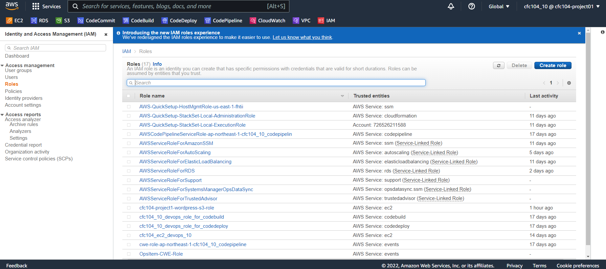

#  AWS set up


## Summary
return [Summary](#summary)

- [AWS set up](#aws-set-up)
  - [Summary](#summary)
  - [IAM](#iam)
    - [Group](#group)
    - [User](#user)
    - [User groups](#user-groups)
    - [Account Alias](#account-alias)
  - [CloudWatch](#cloudwatch)
    - [Billing Alarms](#billing-alarms)
      - [帳單超過 10 USD 通知](#帳單超過-10-usd-通知)
    - [EC2 Alarms](#ec2-alarms)
      - [CPU利用率超過80%通知](#cpu利用率超過80通知)
  - [EC2](#ec2)
  - [~~ECR~~](#ecr)
  - [RDS](#rds)
  - [VPC](#vpc)
    - [internet gateway](#internet-gateway)
    - [igw attach to VPC](#igw-attach-to-vpc)
    - [subnet](#subnet)
      - [public subnet](#public-subnet)
      - [private subnet](#private-subnet)
    - [~~NAT gateway for private subnet~~](#nat-gateway-for-private-subnet)
    - [route table](#route-table)
    - [route table for private subnet](#route-table-for-private-subnet)
    - [test ssh 172.16.0.10 -> 172.16.101.10](#test-ssh-17216010---1721610110)
  - [godaddy DNS 管理](#godaddy-dns-管理)
  - [Route53](#route53)
    - [Route53 private hosted zones add RDS](#route53-private-hosted-zones-add-rds)
  - [S3](#s3)
    - [Automatically uploads media to Amazon S3](#automatically-uploads-media-to-amazon-s3)
      - [Properties -> Transfer acceleration -> Enabled](#properties---transfer-acceleration---enabled)
      - [Permissions -> CORS](#permissions---cors)
      - [add media-cloud user](#add-media-cloud-user)
        - [Create policy](#create-policy)
    - [S3使用前](#s3使用前)
    - [S3使用後](#s3使用後)
  - [CloudTrail](#cloudtrail)
  - [SSM](#ssm)
    - [建立一個 IAM 角色，該角色將用於授予 Systems Manager 權限](#建立一個-iam-角色該角色將用於授予-systems-manager-權限)
    - [EC2 -> Actions -> Security -> Modify IAM role](#ec2---actions---security---modify-iam-role)
    - [Systems Manager -> Node Management -> Fleet Manager](#systems-manager---node-management---fleet-manager)
    - [為混合環境 (Linux) 安裝 SSM 代理](#為混合環境-linux-安裝-ssm-代理)
      - [打開高級實例層](#打開高級實例層)
  - [Pricing Calculator](#pricing-calculator)


-----

## IAM
return [Summary](#summary)

### Group
return [Summary](#summary)

參數
Name | Value
-|-
Group name|cfc104_project





-----

### User
return [Summary](#summary)

參數
Name | Value
-|-
User name|cfc104_02,cfc104_03,cfc104_06,cfc104_10


-----
### User groups
return [Summary](#summary)

參數
Name | Value
-|-
Permission|AWSCodeCommitPowerUser, AWSCodeCommitFullAccess


-----
### Account Alias
return [Summary](#summary)

參數
Name | Value
-|-
Account Alias|cfc104-project01


-----


## CloudWatch
return [Summary](#summary)

使用 CloudWatch 代理從 Amazon EC2 實例和本地服務器收集指標和日誌
<https://docs.aws.amazon.com/AmazonCloudWatch/latest/monitoring/Install-CloudWatch-Agent.html>


### Billing Alarms
return [Summary](#summary)


#### 帳單超過 10 USD 通知
return [Summary](#summary)


-----


### EC2 Alarms
return [Summary](#summary)

#### CPU利用率超過80%通知
return [Summary](#summary)

cfc104-project1-wordpress-ec2-public
cfc104-project1-wordpress-ec2-CPU-topic





-----


## EC2
return [Summary](#summary)

參數
Name | Value
-|-
EC2|cfc104-project1-wordpress-ec2-public
Amazon Machine Image (AMI)|Amazon Linux 2 AMI (HVM) - Kernel 5.10, SSD Volume Type
Instance Type|t2.micro
Network|cfc104-project1-wordpress-VPC
subnet|cfc104-project1-wordpress-subnet-public
Volume Type|General Purpose SSD (gp2)
Security Group|cfc104-project1-wordpress-sg-public


-----

## ~~ECR~~
return [Summary](#summary)


-----

## RDS
return [Summary](#summary)

cfc104-project1-wordpress-rds


使用在 Amazon RDS 外部運行的 MariaDB 或 MySQL 實例進行複制
<https://docs.aws.amazon.com/AmazonRDS/latest/UserGuide/MySQL.Procedural.Importing.External.Repl.html>







-----

## VPC
return [Summary](#summary)

參考: [VPC的建立V2.pdf](VPC的建立V2.pdf)


### internet gateway
return [Summary](#summary)


### igw attach to VPC
return [Summary](#summary)


### subnet
return [Summary](#summary)

#### public subnet
return [Summary](#summary)


#### private subnet
return [Summary](#summary)


### ~~NAT gateway for private subnet~~
return [Summary](#summary)


### route table
return [Summary](#summary)


### route table for private subnet
return [Summary](#summary)


private route table 中增加 NAT gateway 的位置


### test ssh 172.16.0.10 -> 172.16.101.10
return [Summary](#summary)


-----

## godaddy DNS 管理
return [Summary](#summary)


-----

## Route53
return [Summary](#summary)

cfc104.project1.com


### Route53 private hosted zones add RDS
return [Summary](#summary)


RDS Endpoint
cfc104-project1-wordpress-rds.cn08hpayvo0z.us-east-1.rds.amazonaws.com


-----

## S3
return [Summary](#summary)


cfc104-project1-wordpress-s3





### Automatically uploads media to Amazon S3
return [Summary](#summary)

#### Properties -> Transfer acceleration -> Enabled
return [Summary](#summary)


#### Permissions -> CORS
return [Summary](#summary)

Getting Started with Amazon S3 and Media Cloud
<https://www.youtube.com/watch?v=kjFCACrPRtU>

如何在 Amazon S3 中設定 CORS 並使用 cURL 確認 CORS 規則？
<https://aws.amazon.com/tw/premiumsupport/knowledge-center/s3-configure-cors/>

```
[
    {
        "AllowedHeaders": [
            "*"
        ],
        "AllowedMethods": [
            "GET",
            "PUT",
            "POST",
            "HEAD"
        ],
        "AllowedOrigins": [
            "*"
        ],
        "ExposeHeaders": [],
        "MaxAgeSeconds": 3000
    }
]
```


#### add media-cloud user
return [Summary](#summary)

cfc104-project1-wordpress-media-cloud





##### Create policy
return [Summary](#summary)


Sample IAM JSON Policy
```
{
    "Version": "2012-10-17",
    "Statement": [
        {
            "Effect": "Allow",
            "Action": [
                "s3:DeleteObjectTagging",
                "s3:ListBucketMultipartUploads",
                "s3:DeleteObjectVersion",
                "s3:ListBucket",
                "s3:DeleteObjectVersionTagging",
                "s3:GetBucketAcl",
                "s3:ListMultipartUploadParts",
                "s3:PutObject",
                "s3:GetObjectAcl",
                "s3:GetObject",
                "s3:AbortMultipartUpload",
                "s3:DeleteObject",
                "s3:GetBucketLocation",
                "s3:PutObjectAcl"
            ],
            "Resource": [
                "arn:aws:s3:::cfc104-project1-wordpress-s3/*",
                "arn:aws:s3:::cfc104-project1-wordpress-s3"
            ]
        },
        {
            "Effect": "Allow",
            "Action": "s3:HeadBucket",
            "Resource": "*"
        }
    ]
}
```





### S3使用前


### S3使用後


-----

## CloudTrail
return [Summary](#summary)


cfc104-project1-wordpress-CloudTrail


-----


## SSM
return [Summary](#summary)


AWS Systems Manager 節點管理
<https://docs.aws.amazon.com/systems-manager/latest/userguide/systems-manager-instances-and-nodes.html>


使用 AWS Systems Manager 在 EC2 執行個體上
<https://aws.amazon.com/tw/getting-started/hands-on/remotely-run-commands-ec2-instance-systems-manager/>


### 建立一個 IAM 角色，該角色將用於授予 Systems Manager 權限
return [Summary](#summary)


cfc104-project1-wordpress-SSM-Role

AmazonEC2RoleforSSM





### EC2 -> Actions -> Security -> Modify IAM role
return [Summary](#summary)


### Systems Manager -> Node Management -> Fleet Manager
return [Summary](#summary)


### 為混合環境 (Linux) 安裝 SSM 代理

https://docs.aws.amazon.com/systems-manager/latest/userguide/sysman-install-managed-linux.html


https://s3.ap-northeast-1.amazonaws.com/amazon-ssm-ap-northeast-1/latest/linux_amd64/amazon-ssm-agent.rpm


```
Activation Code   sU+5fsUX4W7cALtoAp13
Activation ID   4601fdcf-5568-4c28-8653-f7839f681323
Region   us-east-1
```


安裝 SSM 代理
Amazon Linux 2、RHEL 7.x、Oracle Linux 和 CentOS 7.x
```
mkdir /tmp/ssm
curl https://s3.amazonaws.com/ec2-downloads-windows/SSMAgent/latest/linux_amd64/amazon-ssm-agent.rpm -o /tmp/ssm/amazon-ssm-agent.rpm
sudo yum install -y /tmp/ssm/amazon-ssm-agent.rpm
sudo systemctl stop amazon-ssm-agent
sudo -E amazon-ssm-agent -register -code "sU+5fsUX4W7cALtoAp13" -id "4601fdcf-5568-4c28-8653-f7839f681323" -region "us-east-1"
sudo systemctl start amazon-ssm-agent
```


解決錯誤

```
sudo cp /etc/amazon/ssm/seelog.xml.template /etc/amazon/ssm/seelog.xml
sudo find / -name "seelog.xml.template"
ls /snap/amazon-ssm-agent/
ls /snap/amazon-ssm-agent/current/
sudo mkdir -p /etc/amazon/ssm/
sudo cp /snap/amazon-ssm-agent/current/seelog.xml.template /etc/amazon/ssm/seelog.xml

sudo /snap/amazon-ssm-agent/current/amazon-ssm-agent -register -code "GIpOr218Vx3v5G+3p6Rp" -id "164e0626-cb16-4918-aa50-947c80627e2a" -region "ap-northeast-1"


確認狀況
sudo systemctl start snap.amazon-ssm-agent.amazon-ssm-agent.service
sudo systemctl status snap.amazon-ssm-agent.amazon-ssm-agent.service
```


#### 打開高級實例層


## Pricing Calculator
return [Summary](#summary)

https://calculator.aws/#/estimate?id=2ccf19c71ca8cdd66a7154f3c96df1fa45153c76


