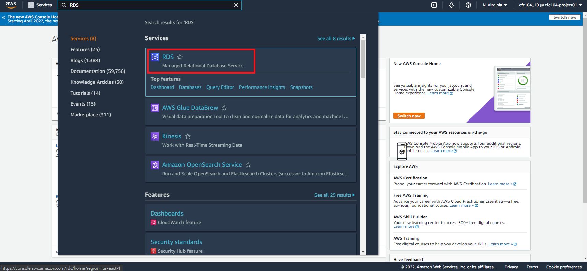
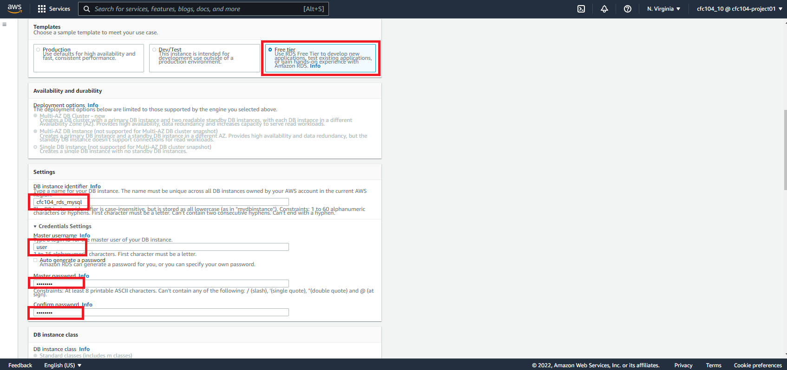
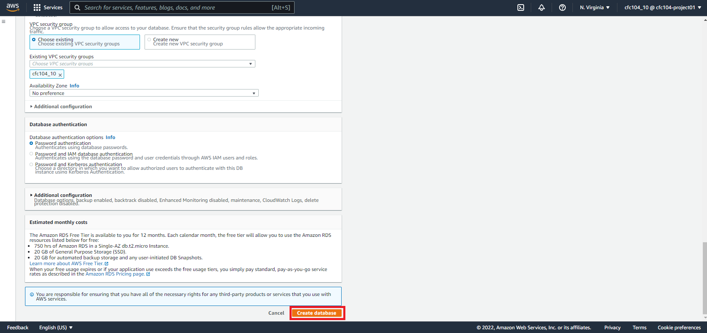
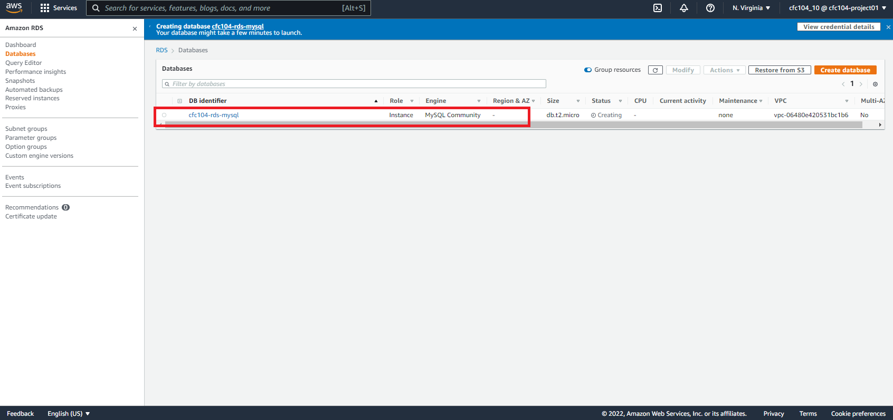
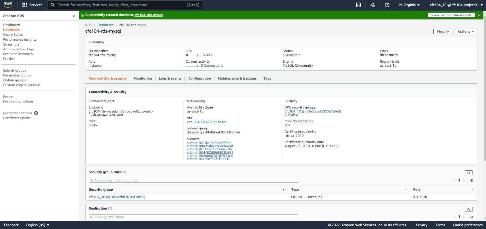

## Summary
return [Summary](#summary)

- [Summary](#summary)
- [IAM](#iam)
  - [Group](#group)
  - [User](#user)
  - [Account Alias](#account-alias)
  - [Billing Alarms](#billing-alarms)
- [EC2](#ec2)
- [ECR](#ecr)
- [RDS](#rds)
- [VPC](#vpc)
  - [internet gateway](#internet-gateway)
  - [igw attach to VPC](#igw-attach-to-vpc)
  - [subnet](#subnet)
    - [public subnet](#public-subnet)
    - [private subnet](#private-subnet)
  - [NAT gateway for private subnet](#nat-gateway-for-private-subnet)
  - [route table](#route-table)
  - [route table for private subnet](#route-table-for-private-subnet)
  - [test ssh 172.16.0.10 ->172.16.101.10](#test-ssh-17216010--1721610110)
- [godaddy DNS 管理](#godaddy-dns-管理)

## IAM
return [Summary](#summary)

### Group
return [Summary](#summary)

-----

### User
return [Summary](#summary)

-----
### Account Alias
return [Summary](#summary)

cfc104-project01

-----

### Billing Alarms
return [Summary](#summary)

-----

## EC2
return [Summary](#summary)

-----

## ECR
return [Summary](#summary)

-----

## RDS
return [Summary](#summary)

使用在 Amazon RDS 外部運行的 MariaDB 或 MySQL 實例進行複制
<https://docs.aws.amazon.com/AmazonRDS/latest/UserGuide/MySQL.Procedural.Importing.External.Repl.html>

## VPC
return [Summary](#summary)

參考: [VPC的建立V2.pdf](VPC的建立V2.pdf)

### internet gateway
return [Summary](#summary)

### igw attach to VPC
return [Summary](#summary)

### subnet
return [Summary](#summary)

#### public subnet
return [Summary](#summary)

#### private subnet
return [Summary](#summary)

### NAT gateway for private subnet
return [Summary](#summary)

### route table
return [Summary](#summary)

### route table for private subnet
return [Summary](#summary)

private route table 中增加 NAT gateway 的位置

### test ssh 172.16.0.10 ->172.16.101.10
return [Summary](#summary)

## godaddy DNS 管理
return [Summary](#summary)

