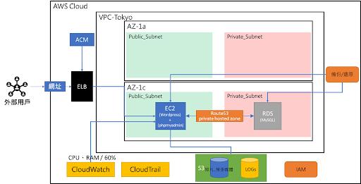

## AWS雲端經典架構建置WordPress網站


目標/綱要
運用AWS雲端經典架構，建置出安全性高的WordPress網站，並完成自動化監控，並蒐集相關Log、自動備份
並預先規劃好未來要走高併發架構的下一步




文件撰寫範例:
[文件範例](./003_網路環境內部域名串接-Route53.md)

### 資源命名規則(含Tag)
cfc102-testAA-BBBBB-CCCCC
AA是你的座號
BBBBB是你的應用或用途
CCCCC是你使用的資源名稱
※例如: cfc102-test99-wordpress-EC2


### 功能及規格
項次| 功能名稱|功能描述/規格|備註
-|-|-|-
1 | 雲端網路環境 | 描述:<br>新建一個網路環境，預先配置好後續會使用到的網路環境，AP伺服器及DB伺服器，將放置於此網路環境。<br><br><br>規格:<br>VPC<br>新建一個VPC<br>切割2個公網段、2個私網段<br>(預先配置網段，未來高併發架構時，可直接使用)<br>1公1私網段，同屬一個AZ可用區域<br><br>開啟Flow logs蒐集公網段的流量紀錄 | CIDR可自訂
2 | 虛擬機器伺服器 | 描述:<br>新建一台機器，並將流程自動化，一開機器就能自動佈已經安裝好相關程式，採手動安裝及部屬的方式進行<br><br><br>規格:<br>EC2<br>使用EC2新建一台Instance<br>系統: Amazon Linux 2 AMI<br>規格: t2.micro type (1核/1G) 以上<br>防火牆: SG開80/443 port (建置過程中可開22)<br>固定IP: EIps<br>硬碟: EBS gp2 15GB<br>金鑰: cfc102-testXX.pem<br>(XX是座號)<br>與DB伺服器同一AZ可用區域<br>軟體: WordPress / PHPmyAdmin<br>開機自動化腳本: userdata<br>安裝docker<br>安裝docker-compose<br>安裝git | 
3 | ELB及ACM的https加密 | 描述:<br>建置ELB連接到EC2，並透過ACM服務申請憑證，建立https加密連線機制，確保資料傳輸交付時的安全性 | <br><br>規格:<br>ELB監聽器 443 -> 80<br>ELB Health CHeck位置 /index.php
4 | 資料庫 | 描述:<br>將AP與DB分離成不同主機，並使用RDS服務，託管資料庫。<br><br><br>規格:<br>RDS<br>放置於私網段，不設定公開<br>MySQL / 5.7.31<br>db.t2.micro (1核/1G)<br>30GB<br>與AP伺服器同一AZ可用區域 | 
5 | 內部DNS | 描述:<br>建立一個內部DNS，並指向資料庫主機的位置<br><br><br>規格:<br>Route53<br>private hosted zones<br>Domain Name: cfc102testXX.internal.db<br>CNAME Record | 
6 | 資源監控與警告 | 描述:<br>建立監控指標，針對處理器及記憶體的資源負載進行監控<br><br><br>規格:<br>CloudWatch / SNS<br>警告閥值:<br>EC2的<br>CPU 平均使用率 60%<br>RAM 平均使用率 60%<br>信件通知自己信箱<br><br><br>設定自己一個儀表板，將WP伺服器的監控指標整合進去<br>CPU: 平均使用率<br>RAM: 平均使用率/可用容量/已用容量/總容量<br>DISK: 平均使用率/可用容量/已用容量/總容量 | 
7 | 服務日誌紀錄 | 描述:<br>蒐集網站存取log並針對服務狀態進行監控<br><br><br>規格:<br>CloudWatch logs<br>蒐集WORDPRESS acces.log / error.log<br>並透過AWS CLI 設定排程，定期上傳至私有S3 | 
8 | 用戶及資源權限控管 | 描述:<br>設定服務角色及使用者管理角色權限<br><br><br>規格:<br>IAM<br>設定EC2 Role，需與S3.RDS.Cloudwatch存取<br>設定使用者權限僅可操作功能列表內的服務 | 
9 | 備份/還原 | 描述:<br>將虛擬主機及資料庫進行週期備份<br><br><br>規格:<br>Snapshot<br>Instance 7天一次循環快照<br>RDS 7天一次循環快照<br>最多保留兩個 | 
10 | 物件儲存 | 描述:<br>WordPress內的圖片影片，都自動存放於S3內，並對外開放<br><br><br>WP Offload Media Lite – 可使用 Amazon S3、DigitalOcean Spaces 及 Google Cloud Storage<br><br><br>規格:<br>S3<br>建一個Bucket設定公開(串接WordPress媒體庫用)<br>建一個Bucket不公開(僅提供內部資料提取使用，包含儲存log使用) | 
11 | 外部DNS | 描述:<br>將有一個對外的域名網址，可供用戶透過此域名網址，訪問此平台系統。<br><br><br>規格:<br>用老師的DNS<br>Domain Name: cfc102-testxx.cxcxc.name<br>設定CNAME Record，綁定至ELB位置<br><br><br>請至下方輸入DNS驗證及記錄資訊<br>CFC102_測驗_DNS | 
12 | 人員操作紀錄監控 | 描述:<br>透過CloudTrail進行人員及資源的操作紀錄，並已確認日後的存取操作行為的紀錄 | 


指定的佈景主題: Astra
並安裝 starter templates


```
version: '3.8'

services:

  wordpress:
    image: wordpress
    restart: always
    container_name: wordpress-web
    ports:
      - 80:80
    environment:
      WORDPRESS_DB_HOST: db
      WORDPRESS_DB_USER: root
      WORDPRESS_DB_PASSWORD: 123456
      WORDPRESS_DB_NAME: exampledb
    volumes:
      - ./html:/var/www/html

  phpmyadmin:
    image: phpmyadmin
    restart: always
    container_name: phpmyadmin-db-console
    ports:
      - 8080:80
    environment:
      - PMA_ARBITRARY=1
```


