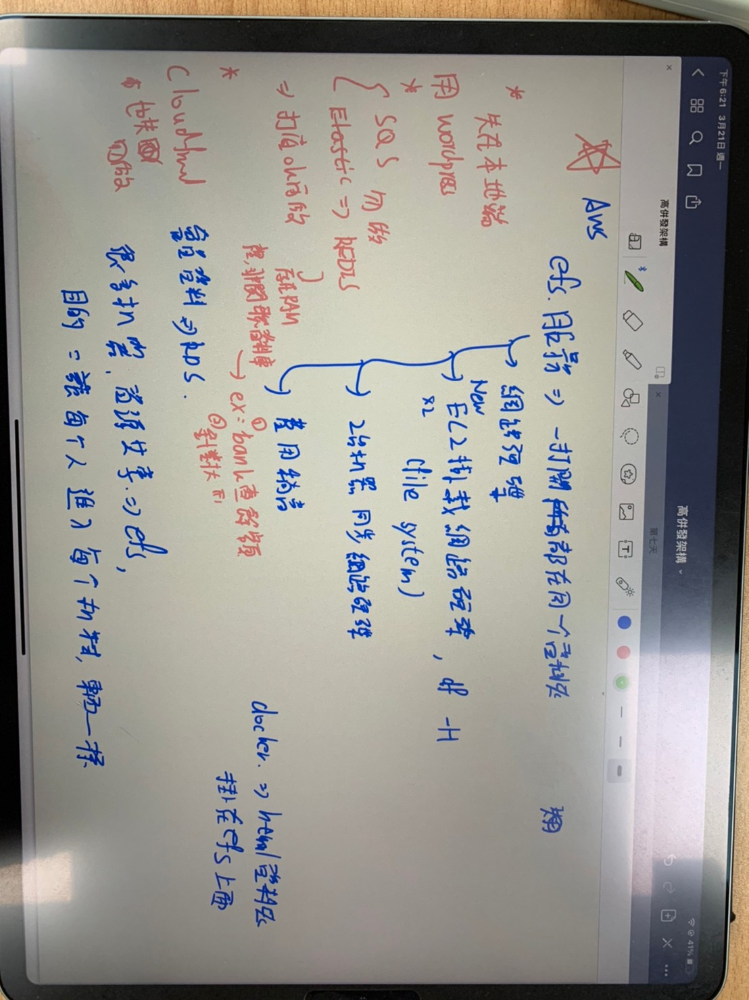
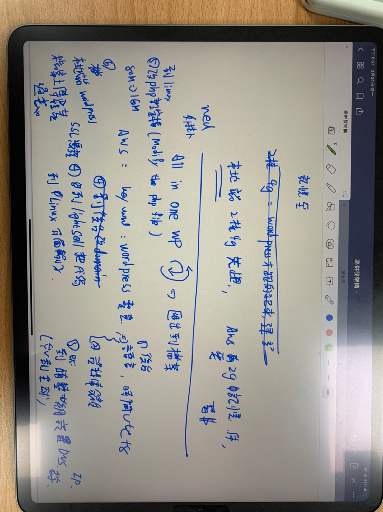
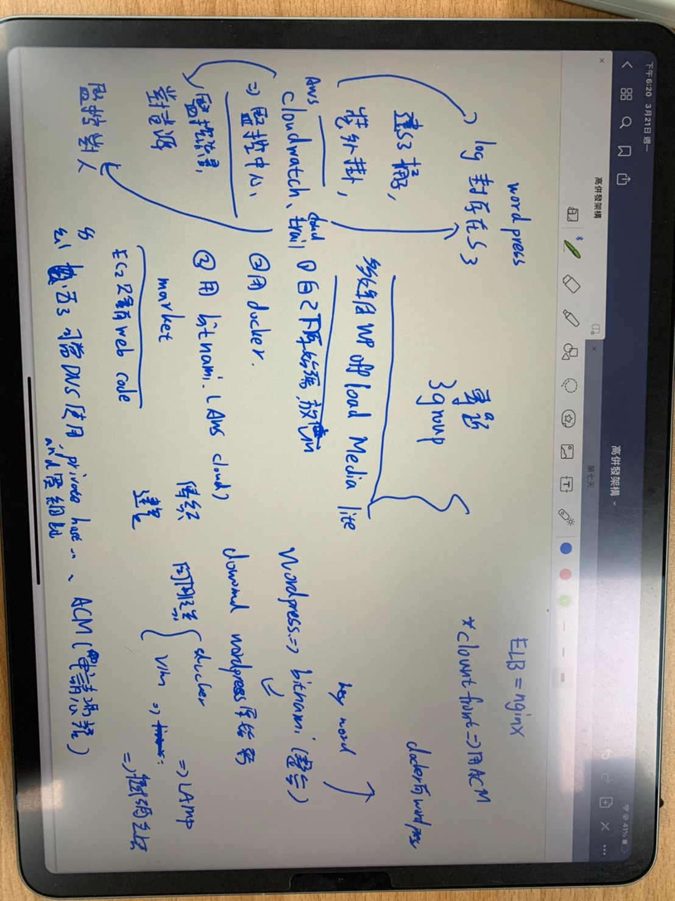
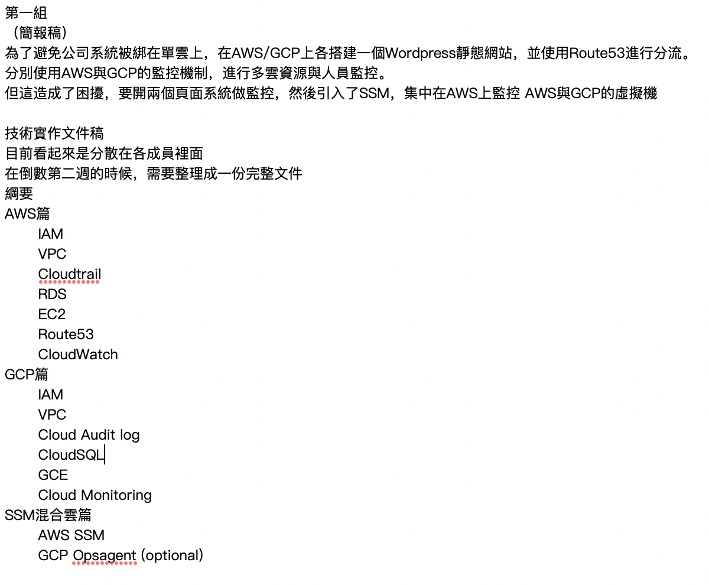

# 會議記錄

## Summary
return [Summary](#summary)

- [會議記錄](#會議記錄)
  - [Summary](#summary)
  - [2022/03/17](#20220317)
  - [2022/03/19](#20220319)
  - [2022/03/21](#20220321)
  - [2022/03/23](#20220323)
  - [2022/03/29](#20220329)
  - [2022/03/30](#20220330)
  - [2022/04/11](#20220411)

## 2022/03/17

wordpress/WooCommerce 網站主題 (形象網站,雜貨舖, 商城...)

架構圖
AWS 規劃,建置,維護

開會(每天一次)

工作日誌(自己)

分工

-----

## 2022/03/19

找咖啡廳要有插座不限時

奧蘿茉CAFE北車店
100台北市中正區南陽街26號
02 2311 7070 https://g.co/kgs/exAd12

和其他組合作?

-----

## 2022/03/21

購買域名

參考bitnami/wordpress

GCP 對應服務

log & 多媒體移至S3

-----

## 2022/03/23

02,03 可在 local run wordpress

-----

## 2022/03/29

1. 本地Wordpress 外掛安裝 S3(多媒體圖片) 、安裝All-in-one WP (以軟體方式全部遷移本地網址覆蓋)
2. 裝cloudtrail (觀察人員做什麼事情)
3. 上架到ec2將wordpress匯入(S3)
4. 安裝Route53(DNS)內部域名解析
5. 以NGINX安裝Https憑證
6. 下載AWS ICON 簡報當作繪圖軟體

-----

## 2022/03/30

-----

## 2022/04/11

簡報順序:

1. 故事開場
2. 情境一: 疫情需求電商
3. 需求: 雲端優勢: 不需前期購買實體伺服器，及後端網站服務
                  運算、網路(VPC) 、儲存、管理(SG,IAM,NACL) 故事
4. 架構總介紹
5. 情境二 因要申請雲補助計畫需要合規及治理，及在台灣(GCP)
6. 需求
7. 監控 故事
8. 架構總介紹
9. Aws與gcp一代與二代比較

