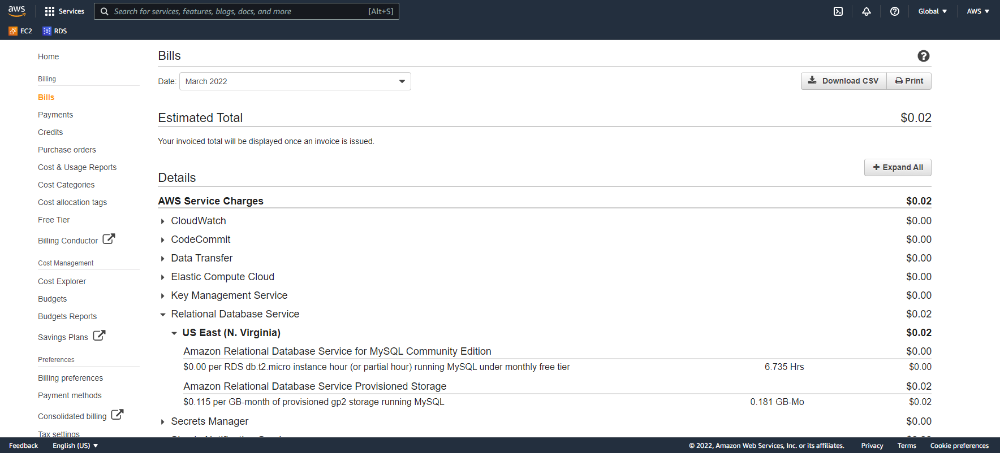
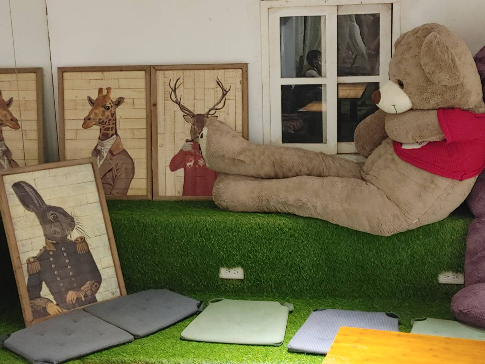

# 工作日誌

## Summary
return [Summary](#summary)
- [工作日誌](#工作日誌)
  - [Summary](#summary)
  - [2022/03/18](#20220318)
  - [03/26](#0326)
  - [03/28](#0328)
  - [03/30](#0330)
  - [04/04](#0404)
  - [04/06](#0406)

## 2022/03/18
return [Summary](#summary)

可在本地端VM CentOS 

資料庫帳單

https://ithelp.ithome.com.tw/users/20100951/ironman/4671

## 03/26
return [Summary](#summary)

去奧蘿茉CAFE北車店，
位置在滴妹開的[再睡5分鐘]旁邊，
目前還是不限時而且有插座，
低消是一杯飲料，
飲料大概都是100左右，
餐點200起跳，
有免費的水跟廁所。
3F以上開放到19:30，2F以下開放到21:00。
要多人去的話要早一點去佔位，人蠻多的。

## 03/28
return [Summary](#summary)

VPC config

## 03/30
return [Summary](#summary)

買公開域名
GoDaddy

## 04/04
return [Summary](#summary)

nginx config

可以透過 https 域名 正常顯示網站

## 04/06
return [Summary](#summary)

可匯入網站

k6 壓力測試

使用 Amazon Route53 將網域名稱連線至 WordPress 網站
https://aws.amazon.com/tw/getting-started/hands-on/get-a-domain/

使用 Elastic Load Balancer 和 Amazon CloudFront 擴展WordPress
https://d0.awsstatic.com/whitepapers/deploying-wordpress-with-aws-elastic-beanstalk.pdf

wordpress 變更網站 URL
https://wordpress.org/support/article/changing-the-site-url/

-----

第一階段

wordpress 簡易樣板

可在 local 上正常執行下圖架構

可在 AWS 上正常執行下圖架構

AWS and GCP 服務對應資料蒐集

-----

第二階段

wordpress/WooCommerce 基本功能

服務分離(資料庫)

使用 Amazon RDS 部署 WordPress
https://aws.amazon.com/tw/getting-started/hands-on/deploy-wordpress-with-amazon-rds/

網路配置

建立CI/CD

第三階段

AWS 架構嘗試在 GCP 上重現

-----

第N階段

文件

