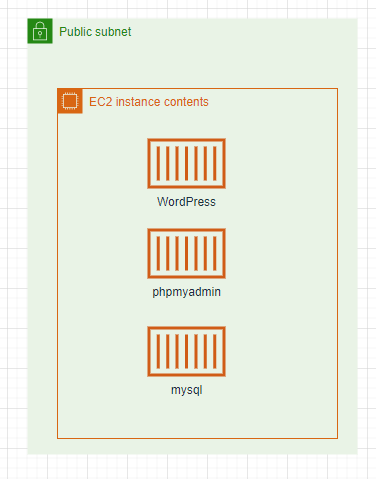

# 工作日誌

## Summary
return [Summary](#summary)
- [工作日誌](#工作日誌)
  - [Summary](#summary)
  - [2022/03/18](#20220318)

## 2022/03/18

可在本地端VM CentOS 

https://ithelp.ithome.com.tw/users/20100951/ironman/4671

-----

第一階段

wordpress 簡易樣板

可在local上正常執行下圖架構

可在AWS上正常執行下圖架構

AWS and GCP 服務對應資料蒐集

-----

第二階段

wordpress/WooCommerce 基本功能

服務分離(資料庫)

網路配置

建立CI/CD

-----

第N階段

AWS 架構嘗試在 GCP 上重現

