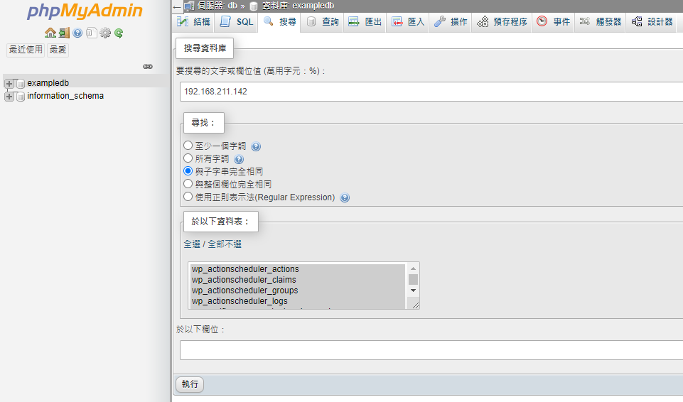
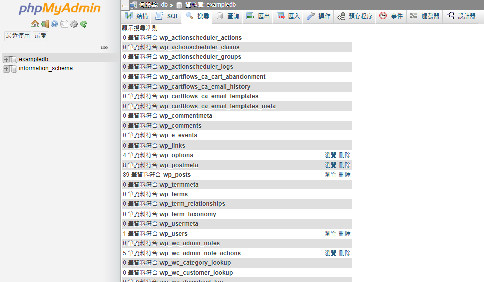
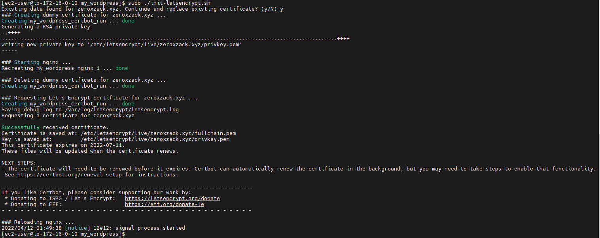
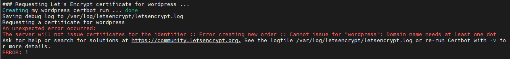
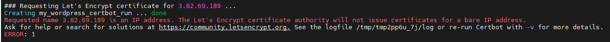
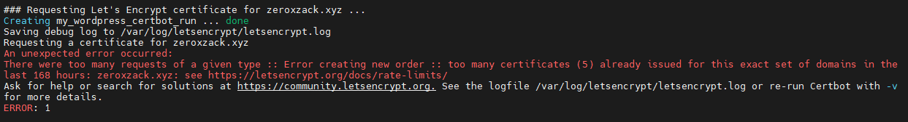

## Summary
return [Summary](#summary)
- [Summary](#summary)
- [Docker image](#docker-image)
- [Git](#git)
  - [create a new repository on the command line](#create-a-new-repository-on-the-command-line)
  - [push an existing repository from the command line](#push-an-existing-repository-from-the-command-line)
  - [git reset](#git-reset)
- [wordpress config](#wordpress-config)
- [Mysql 遷移](#mysql-遷移)
- [codecommit](#codecommit)
  - [SSH 和 Linux、macOS 或 Unix：設定 Git 和 CodeCommit 的公有和私有金鑰](#ssh-和-linuxmacos-或-unix設定-git-和-codecommit-的公有和私有金鑰)
- [nginx](#nginx)
  - [nginx-and-lets-encrypt-with-docker](#nginx-and-lets-encrypt-with-docker)
  - [裝插件的方法](#裝插件的方法)
  - [變更上傳限制的方法](#變更上傳限制的方法)
  - [https jpg,css...](#https-jpgcss)
- [tools command line](#tools-command-line)
  - [debug command line](#debug-command-line)
  - [傳檔案](#傳檔案)
- [Note](#note)

---

https://hub.docker.com/_/wordpress


https://qiita.com/vc7/items/e88026c75f2280f95ed4


建立並切換目錄
```
mkdir -p my_wordpress && cd my_wordpress
```

編輯 docker-compose.yml
```
vim docker-compose.yml
```

docker-compose.yml 內容
```
version: '3.8'

services:
  wordpress:
    image: wordpress:5.9.2
    restart: always
    container_name: wordpress-web
    ports:
      - 80:80
    environment:
      WORDPRESS_DB_HOST: db
      WORDPRESS_DB_USER: root
      WORDPRESS_DB_PASSWORD: 123456
      WORDPRESS_DB_NAME: exampledb
    volumes:
      - ./html:/var/www/html

  db:
    image: mysql:5.7
    restart: always
    container_name: mysql-db
    environment:
      MYSQL_DATABASE: exampledb
      MYSQL_USER: user
      MYSQL_PASSWORD: 123456
      MYSQL_ROOT_PASSWORD: 123456
    volumes:
      - ./db_data:/var/lib/mysql

  phpmyadmin:
    image: phpmyadmin
    restart: always
    container_name: phpmyadmin-db-console
    ports:
      - 8080:80
    environment:
      - PMA_ARBITRARY=1
```


執行 docker compose
```
docker-compose up -d
```


關閉 docker compose
```
docker-compose down
```


管理介面 URL
http://<CentOS的IP>/wp-admin/

呈現介面 URL
http://<CentOS的IP>


http://192.168.211.142/wp-admin/


## Docker image
return [Summary](#summary)


```
// 建立映像檔
docker build --rm -t my_wordpress .

// 映像檔建立 refernece
docker tag my_wordpress rockexe0000/my_wordpress

// 映像檔推送到 docker hub
docker image push rockexe0000/my_wordpress

docker run -itd my_wordpress


docker run 

```

ec2 User data
```
Content-Type: multipart/mixed; boundary="//"
MIME-Version: 1.0

--//
Content-Type: text/cloud-config; charset="us-ascii"
MIME-Version: 1.0
Content-Transfer-Encoding: 7bit
Content-Disposition: attachment; filename="cloud-config.txt"

#cloud-config
cloud_final_modules:
- [scripts-user, always]

--//
Content-Type: text/x-shellscript; charset="us-ascii"
MIME-Version: 1.0
Content-Transfer-Encoding: 7bit
Content-Disposition: attachment; filename="userdata.txt"

#!/bin/bash
yum update -y
yum install -y amazon-cloudwatch-agent

amazon-linux-extras install -y docker
service docker start
usermod -a -G docker ec2-user

curl -L "https://github.com/docker/compose/releases/download/1.29.2/docker-compose-$(uname -s)-$(uname -m)" -o /usr/local/bin/docker-compose
chmod +x /usr/local/bin/docker-compose
ln -s /usr/local/bin/docker-compose /usr/bin/docker-compose

yum install git -y
git clone https://github.com/rockexe0000/my_wordpress
#git pull
cd my_wordpress 
#docker-compose pull
docker-compose up -d
```

如何使用 docker-compose 更新現有圖像？
<https://stackoverflow.com/questions/49316462/how-to-update-existing-images-with-docker-compose>

如何讓 EC2 用戶數據腳本在啟動時再次運行？
<https://serverfault.com/questions/797482/how-to-make-ec2-user-data-script-run-again-on-startup>


-----

## Git
return [Summary](#summary)

git clone https://github.com/rockexe0000/my_wordpress.git


### create a new repository on the command line
return [Summary](#summary)

```
echo "# my_wordpress" >> README.md
git init
git add .
git commit -m "update"
git branch -M main
git remote add origin https://github.com/rockexe0000/my_wordpress.git
git push -u origin main
```


### push an existing repository from the command line
return [Summary](#summary)

```
git remote add origin https://github.com/rockexe0000/my_wordpress.git
git branch -M main
git push -u origin main
```

### git reset
```
sudo git reset HEAD^ --hard
```

-----

## wordpress config
return [Summary](#summary)

編輯wordpress組態
```
cd my_wordpress/html
vim wp-config.php
```

資料庫組態
```
// ** MySQL settings - You can get this info from your web host ** //
/** The name of the database for WordPress */
define( 'DB_NAME', 'database_name_here' );

/** MySQL database username */
define( 'DB_USER', 'username_here' );

/** MySQL database password */
define( 'DB_PASSWORD', 'password_here' );

/** MySQL hostname */
define( 'DB_HOST', 'localhost' );
```

身份驗證唯一金鑰和鹽認證
可以用<https://api.wordpress.org/secret-key/1.1/salt/>產生
```
/**#@+
 * Authentication Unique Keys and Salts.
 *
 * Change these to different unique phrases!
 * You can generate these using the {@link https://api.wordpress.org/secret-key/1.1/salt/ WordPress.org secret-key service}
 * You can change these at any point in time to invalidate all existing cookies. This will force all users to have to log in again.
 *
 * @since 2.6.0
 */
define( 'AUTH_KEY',         'put your unique phrase here' );
define( 'SECURE_AUTH_KEY',  'put your unique phrase here' );
define( 'LOGGED_IN_KEY',    'put your unique phrase here' );
define( 'NONCE_KEY',        'put your unique phrase here' );
define( 'AUTH_SALT',        'put your unique phrase here' );
define( 'SECURE_AUTH_SALT', 'put your unique phrase here' );
define( 'LOGGED_IN_SALT',   'put your unique phrase here' );
define( 'NONCE_SALT',       'put your unique phrase here' );
```


改 mysql 裡的 IP





```SQL
UPDATE wp_posts SET guid=REPLACE(guid,‘http://www.samllya.tk’,‘http://www.smallya.net’);

UPDATE wp_options SET guid=REPLACE(guid,‘http://www.samllya.tk’,‘http://www.smallya.net’);

UPDATE wp_postmeta SET guid=REPLACE(guid,‘http://www.samllya.tk’,‘http://www.smallya.net’);

```


```
#!/bin/bash

mysql -u username -puserpass dbname -e "UPDATE mytable SET mycolumn = 'myvalue' WHERE id='myid'";

```


```


docker exec mysql-db sh -c 'exec mysql -u user -p123456 exampledb -e "show tables"'


docker exec mysql-db sh -c 'exec mysql -u user -p123456 exampledb -e "UPDATE wp_options SET option_value=REPLACE(option_value,"1.85.11.42","3.86.164.118" );"'


docker exec mysql-db sh -c 'exec mysql -u user -p123456 exampledb -e "UPDATE wp_options SET option_value=REPLACE(option_value,\'1.85.11.42\',\'3.86.164.118\' );"'
```


-----

## Mysql 遷移
return [Summary](#summary)

使用在 Amazon RDS 外部運行的 MariaDB 或 MySQL 實例進行複制
<https://docs.aws.amazon.com/AmazonRDS/latest/UserGuide/MySQL.Procedural.Importing.External.Repl.html>

local端備份
```
docker exec mysql-db sh -c 'exec mysqldump --all-databases -uroot -p"123456"' > all-databases.sql
```

遷移(local -> RDS)
```
docker exec mysql-db sh -c 'mysqldump --databases {database_name} \
    --single-transaction \
    --compress \
    --order-by-primary \
    -u {local_user} \
    -p{local_password} | mysql \
        --host={hostname} \
        --port=3306 \
        -u {RDS_user_name} \
        -p{RDS_password}'
```


-----

## codecommit
return [Summary](#summary)

```
git remote add aws https://git-codecommit.us-east-1.amazonaws.com/v1/repos/cfc104_project1_repo

git config --global credential.helper '!aws codecommit credential-helper $@'

git config --global credential.UseHttpPath true

git push aws --all

```

-----

### SSH 和 Linux、macOS 或 Unix：設定 Git 和 CodeCommit 的公有和私有金鑰
return [Summary](#summary)

<https://docs.aws.amazon.com/zh_tw/codecommit/latest/userguide/setting-up-ssh-unixes.html#setting-up-ssh-unixes-keys-unixes>


```
ssh-keygen

/{home_dir}/.ssh/codecommit_rsa

```

```
[user@localhost .ssh]$ ssh-keygen
Generating public/private rsa key pair.
Enter file in which to save the key (/home/user/.ssh/id_rsa): /home/user/.ssh/codecommit_rsa
Enter passphrase (empty for no passphrase):
Enter same passphrase again:
Your identification has been saved in /home/user/.ssh/codecommit_rsa.
Your public key has been saved in /home/user/.ssh/codecommit_rsa.pub.
The key fingerprint is:
SHA256:TKNRS0r9jdwGRt6MoM9mfT070JraWcPVu8KuhhHkJfo user@localhost.localdomain
The key's randomart image is:
+---[RSA 2048]----+
|      ..+..      |
|     . =.*o=     |
|      + B+==o    |
|       O =+ +o  .|
|      . S o.o + o|
|       o E . = +.|
|          o + *. |
|         . + = o.|
|          o.=... |
+----[SHA256]-----+
[user@localhost .ssh]$ ls -a
.  ..  codecommit_rsa  codecommit_rsa.pub  config  id_rsa  id_rsa.pub  known_hosts
[user@localhost .ssh]$

```

```
cat ~/.ssh/codecommit_rsa.pub
```

複製這個值。它看起來類似下列：
```
ssh-rsa EXAMPLE-AfICCQD6m7oRw0uXOjANBgkqhkiG9w0BAQUFADCBiDELMAkGA1UEBhMCVVMxCzAJB
gNVBAgTAldBMRAwDgYDVQQHEwdTZWF0dGxlMQ8wDQYDVQQKEwZBbWF6b24xFDASBgNVBAsTC0lBTSBDb2
5zb2xlMRIwEAYDVQQDEwlUZXN0Q2lsYWMxHzAdBgkqhkiG9w0BCQEWEG5vb25lQGFtYXpvbi5jb20wHhc
NMTEwNDI1MjA0NTIxWhcNMTIwNDI0MjA0NTIxWjCBiDELMAkGA1UEBhMCVVMxCzAJBgNVBAgTAldBMRAw
DgYDVQQHEwdTZWF0dGxlMQ8wDQYDVQQKEwZBbWF6b24xFDAS=EXAMPLE user-name@ip-192-0-2-137
```

IAM -> Users -> 選擇User -> 選擇 Security Credentials -> Upload SSH public key


在 IAM 主控台的導覽窗格中，選擇使用者，然後從使用者清單中選擇您的 IAM 使用者。

在使用者詳細資訊頁面，選擇 Security Credentials (安全登入資料) 標籤，然後選擇 Upload SSH public key (上傳 SSH 公有金鑰)。

將 SSH 公有金鑰的內容貼到欄位中，然後選擇 Upload SSH public key (上傳 SSH 公有金鑰)。

複製或儲存 SSH Key ID (SSH 金鑰 ID) 中的資訊 (例如，APKAEIBAERJR2EXAMPLE)。


vim config
```
Host git-codecommit.*.amazonaws.com
  User APKAEIBAERJR2EXAMPLE
  IdentityFile ~/.ssh/codecommit_rsa
```

從終端機，執行下列命令來變更組態檔的許可：
```
chmod 600 config
```


執行下列命令以測試 SSH 組態：
```
ssh git-codecommit.us-east-1.amazonaws.com
```

如需可協助您排除問題的相關資訊，請執行ssh命令與-v參數。例如：
```
ssh -v git-codecommit.us-east-1.amazonaws.com
```


-----

## nginx
return [Summary](#summary)


### nginx-and-lets-encrypt-with-docker
return [Summary](#summary)

Nginx 和讓我們在 5 分鐘內使用 Docker 進行加密
<https://pentacent.medium.com/nginx-and-lets-encrypt-with-docker-in-less-than-5-minutes-b4b8a60d3a71>

[教學] 申請Let’s Encrypt憑證與啟用https (Nginx)
<https://xenby.com/b/101-%E6%95%99%E5%AD%B8-%E7%94%B3%E8%AB%8Blets-encrypt%E6%86%91%E8%AD%89%E8%88%87%E5%95%9F%E7%94%A8https-nginx>

使用 Docker Compose 架設 WordPress 環境
<https://longzonwu.com/software-development/docker-compose-with-wordpress/>

Docker通過Nginx反向代理運行WordPress打開HTTPS綁定域名
https://www.aiprose.com/blog/148


https://www.nginx.com/resources/wiki/start/topics/recipes/wordpress/

「SSL for Free」使用DNS(CNAME)驗證的方法
https://uncleit.net/%E3%80%8Cssl-for-free%E3%80%8D%E4%BD%BF%E7%94%A8dns-cname%E9%A9%97%E8%AD%89%E7%9A%84%E6%96%B9%E6%B3%95.html


AWS 提供免費的 SSL 憑證服務！超簡單懶人包看這裡
https://blog.25sprout.com/aws-%E6%8F%90%E4%BE%9B%E5%85%8D%E8%B2%BB%E7%9A%84-ssl-%E6%86%91%E8%AD%89%E6%9C%8D%E5%8B%99-%E8%B6%85%E7%B0%A1%E5%96%AE%E6%87%B6%E4%BA%BA%E5%8C%85%E7%9C%8B%E9%80%99%E8%A3%A1-9220e2f5bcdb?gi=bd73527c766d


網域
```
zeroxzack.xyz
```


sudo vim data/nginx/app.conf
```
server {
    listen 80;
    server_name zeroxzack.xyz www.zeroxzack.xyz;

    location /.well-known/acme-challenge/ {
    root /var/www/certbot;
    }

    location / {
        return 301 https://$host$request_uri;

    }
}

server {
    listen              443 ssl;
    server_name         zeroxzack.xyz www.zeroxzack.xyz;
    ssl_certificate     /etc/letsencrypt/live/www.zeroxzack.xyz/fullchain.pem;
    ssl_certificate_key /etc/letsencrypt/live/www.zeroxzack.xyz/privkey.pem;
    include /etc/letsencrypt/options-ssl-nginx.conf;
    ssl_dhparam /etc/letsencrypt/ssl-dhparams.pem;
    client_max_body_size 10240M;

    location / {
        resolver 127.0.0.1;
        proxy_pass         http://wordpress/;
        proxy_http_version 1.1;
        proxy_set_header   Upgrade $http_upgrade;
        proxy_set_header   Connection keep-alive;
        proxy_set_header   Host $host;
        proxy_cache_bypass $http_upgrade;
        proxy_set_header   X-Forwarded-For $proxy_add_x_forwarded_for;
        proxy_set_header   X-Forwarded-Proto $scheme;
    }
}
```


將腳本下載到您的工作目錄init-letsencrypt.sh:
```
curl -L https://raw.githubusercontent.com/wmnnd/nginx-certbot/master/init-letsencrypt.sh > init-letsencrypt.sh
```


然後運行
```
chmod +x init-letsencrypt.sh
sudo ./init-letsencrypt.sh
```










-----

### 裝插件的方法
return [Summary](#summary)

```
sudo mkdir html/wp-content/plugins/all-in-one-wp-migration/storage

sudo chmod -R 777 html/wp-content/plugins/all-in-one-wp-migration/storage
```
### 變更上傳限制的方法
return [Summary](#summary)

sudo vim html/.htaccess<br>
後面加入
```
php_value upload_max_filesize 512M
php_value post_max_size 512M
php_value memory_limit 512M
php_value max_execution_time 0
php_value max_input_time 300
```

sudo vim html/wp-config.php<br>
後面加入
```
define( 'FS_METHOD', 'direct' );
define('DISABLE_WP_CRON', true);

@ini_set( 'upload_max_filesize' , '512M' );
@ini_set( 'post_max_size', '512M');
@ini_set( 'memory_limit', '512M' );
@ini_set( 'max_execution_time', '0' );
@ini_set( 'max_input_time', '300' );
```


-----

### https jpg,css...
return [Summary](#summary)


在 wp-config.php 頂部添加以下內容
```
define('FORCE_SSL_ADMIN', true);

if (strpos($_SERVER['HTTP_X_FORWARDED_PROTO'], 'https') !== false){
    $_SERVER['HTTPS'] = 'on';
    $_SERVER['SERVER_PORT'] = 443;
}
if (isset($_SERVER['HTTP_X_FORWARDED_HOST'])) {
    $_SERVER['HTTP_HOST'] = $_SERVER['HTTP_X_FORWARDED_HOST'];
}
```

在 wp-config.php 的末尾添加以下內容。用您的域名替換 example.com
```
define('WP_HOME','https://example.com/');
define('WP_SITEURL','https://exampe.com/');
```


-----

## tools command line
return [Summary](#summary)

### debug command line
return [Summary](#summary)

```
sudo docker exec -it <CONTAINER ID> /bin/bash

docker logs <CONTAINER ID>

```

-----

### 傳檔案
return [Summary](#summary)

連進ec2
```
sudo ssh -i ../cfc104_10.pem ec2-user@172.16.101.10
```

```
scp -i ~/.ssh/mytest.key root@192.168.1.1:/<filepath on host>  <path on client>
```


-----

## Note
return [Summary](#summary)


EFS


All-in-One WP Migration

https://letsencrypt.org/zh-tw/

https://certbot.eff.org/

https://pentacent.medium.com/nginx-and-lets-encrypt-with-docker-in-less-than-5-minutes-b4b8a60d3a71


https://help.servmask.com/2018/10/27/how-to-increase-maximum-upload-file-size-in-wordpress/


Referance:

WooCommerce 中文教學：安裝設定＋功能介紹（完整指南）
<https://frankknow.com/woocommerce-tutorial/>


WordPress 後台教學：給新手的操作教學（全指南）
<https://www.youtube.com/watch?v=oPk3jqZ7wkw>

WordPress 網頁設計教學：如何架設網站＋完整官網製作（不懂程式也做得到）
<https://www.youtube.com/watch?v=5aI53lSJLcQ>
